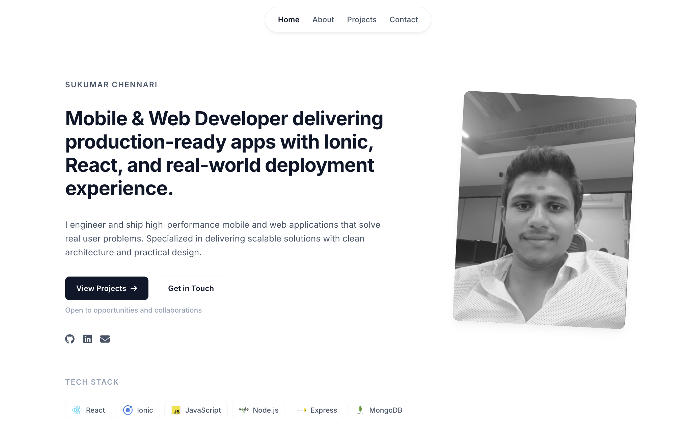

# Sukumar Chennari Portfolio 👩🏽‍🚀

A high-quality, modern, and professional portfolio designed for both job applications and freelance opportunities. Built with React and optimized for real-world impact.

<center>

</center>

## 🚀 Overview

This portfolio showcases my experience as a **Mobile & Web Developer** specializing in delivering production-ready applications. It highlights my expertise in **Ionic, React, and the MERN stack**, with a strong focus on real-world deployment (App Store & Play Store).

-   **Live Demo**: [chennarisukumar.netlify.app](https://chennarisukumar.netlify.app)
-   **LinkedIn**: [linkedin.com/in/sukumar-chennari](https://www.linkedin.com/in/sukumar-chennari/)

## 📙 Features

-   📖 **Hiring-Focused Content**: Outcome-driven project descriptions and deployment highlights.
-   📱 **Full Responsiveness**: Optimized for mobile, tablet, and desktop views.
-   ⚡ **Performance-Led**: Fast loading with clean architecture and practical design.
-   🛠 **Deployment Ready**: Showcases real professional work, including a telemedicine platform.

## 🛠 Tech Stack

-   **Frontend**: React, Ionic
-   **Backend**: Node.js, Express
-   **Database**: MongoDB
-   **Styling**: Vanilla CSS (Premium & Minimal)

## 📚 Getting Started

Clone the repository and install dependencies:

```bash
git clone https://github.com/sukumar-chennari/reactfolio.git
cd reactfolio
npm install
```

Run the development server:

```bash
npm start
```

## 📁 Folder Structure

-   `/public`: Static assets (logos, screenshots).
-   `/src/data`: Core configuration files (`user.js`, `seo.js`).
-   `/src/components`: Modular React components.
-   `/src/pages`: Main application pages and route components.

## ⚙️ Configuration

You can easily customize the content by editing `/src/data/user.js`. This file controls:
-   Hero headline and bio.
-   Project details (titles, descriptions, links, tags).
-   Professional experience and skills.

## 🚀 Building for Production

To create an optimized production build:

```bash
npm run build
```

This generates a `build/` directory ready for deployment to platforms like Netlify, Vercel, or your own server.

## 🤝 Contribution

Feel free to fork this project and adapt it for your own needs. Suggestions and improvements are always welcome via issues or pull requests.

## 📄 License

This project is open-source and available under the MIT License.
